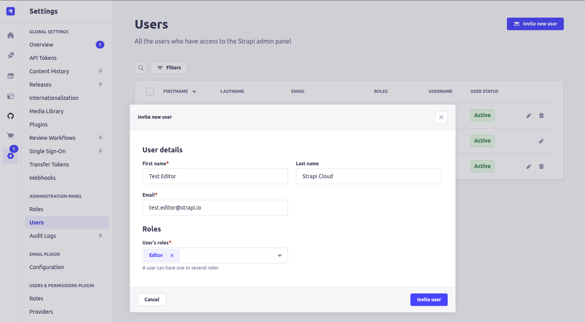
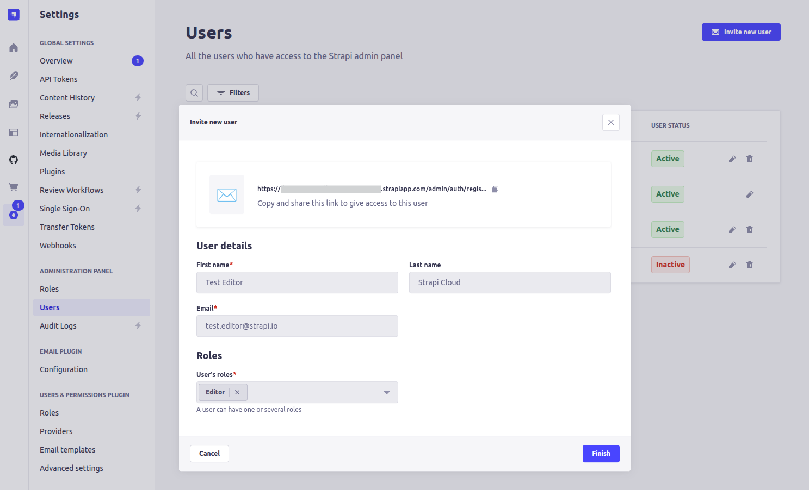
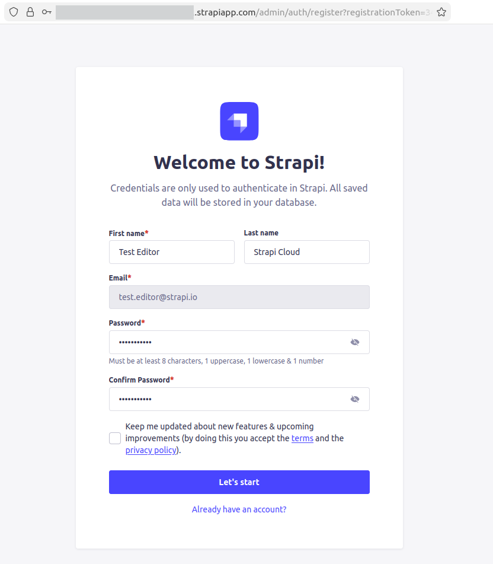
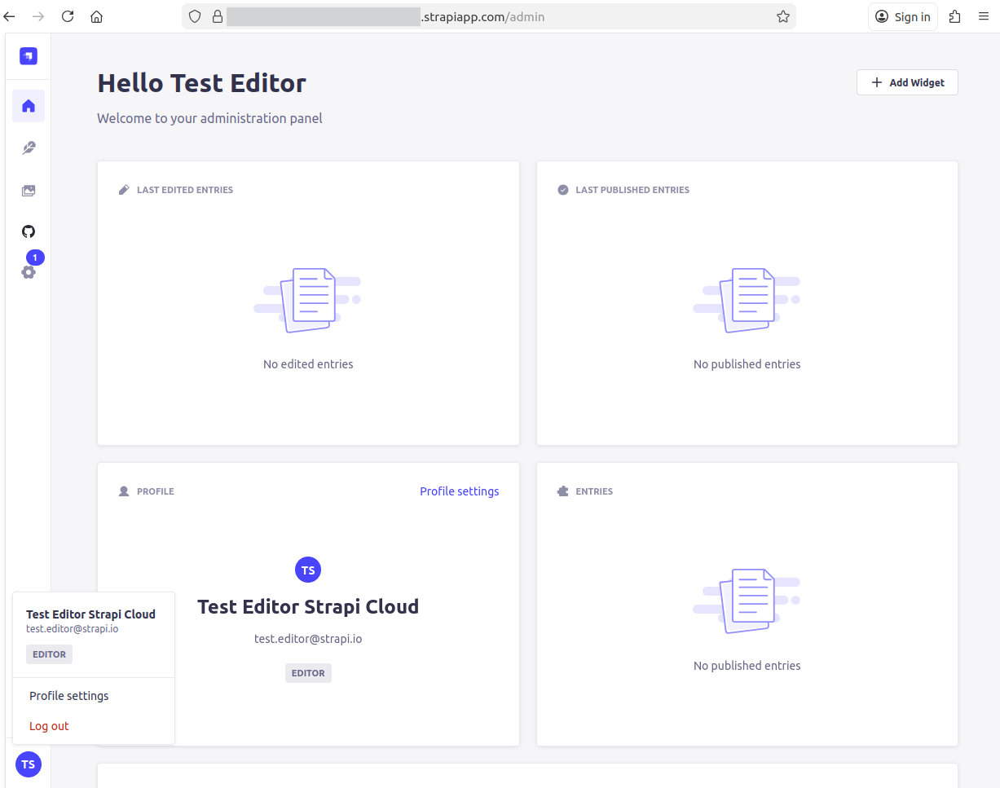

🔙 [README.md](../README.md)

# 💭 Strapi Cloud

## Setup

1. Create a new Project - https://cloud.strapi.io/new-project/my-project

2. connect into GitHub Account

3. define the user name

4. select the repository that contains the Strapi CMS

5. define the display name

6. select the cloud region

7. define which Node.js version should be used

8. setup the needed environment variables

9. click at the Create project button

## Deployments

- They are done when a new commit is made to the assigned branch at the Strapi Cloud project

  - for each deployment, it's available 2 logs

    - Build logs

    - Deployment logs

## Strapi Cloud Instance

**URL:** `https://<project>.strapiapp.com/`

> [!IMPORTANT]
> At the first access, it will be requested to create the `super admin user`
>
> for example:
>
> - name: `Super Admin`
> - email: `admin@strapi.io`
> - password: `Admin987654321`

> [!TIP]
> The first deployment will have a clean state without any content available at the `Content Manager`

### Adding a New user

1. Access the Strapi Cloud Instance

2. Login with a super admin user

3. Access the Settings page

4. Click on the `Administration Panel > Users` menu item

5. Click on the `Invite new user` button

6. Fill up the user information and assign the roles

   For example:

   - First name: `Test Editor`
   - Last name: `Strapi Clould`
   - Email: `test.editor@strapi.io`
   - User's roles: `Editor`

   

7. Click on the `Invite user` button

   Copy the invitation URL: `https://<project>.strapiapp.com/admin/auth/register?registrationToken=<token>`

   

8. Click on the `Finish` button

### New User first access

1. Open the invitation URL `https://<project>.strapiapp.com/admin/auth/register?registrationToken=<token>`

2. Setup the user password

   For example: `pass1@Cloud`

   

3. Click on the `Let's start` button

   

## Useful References

- [Cloud Docs](https://docs.strapi.io/cloud/intro)

  - [Strapi Cloud fundamentals](https://docs.strapi.io/cloud/cloud-fundamentals)

    - API: `https://<project>.strapiapp.com/api/...`

    - Media: `https://<project>.media.strapiapp.com`

  - [Project Settings](https://docs.strapi.io/cloud/projects/settings)

    - [Variables](https://docs.strapi.io/cloud/projects/settings#variables)

  - [Command Line Interface (CLI)](https://docs.strapi.io/cloud/cli/cloud-cli)
