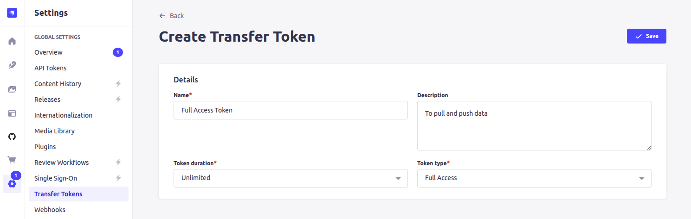
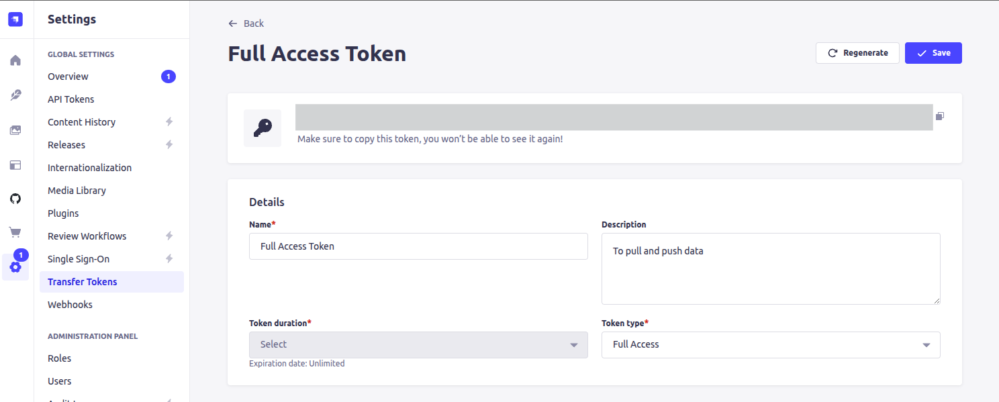
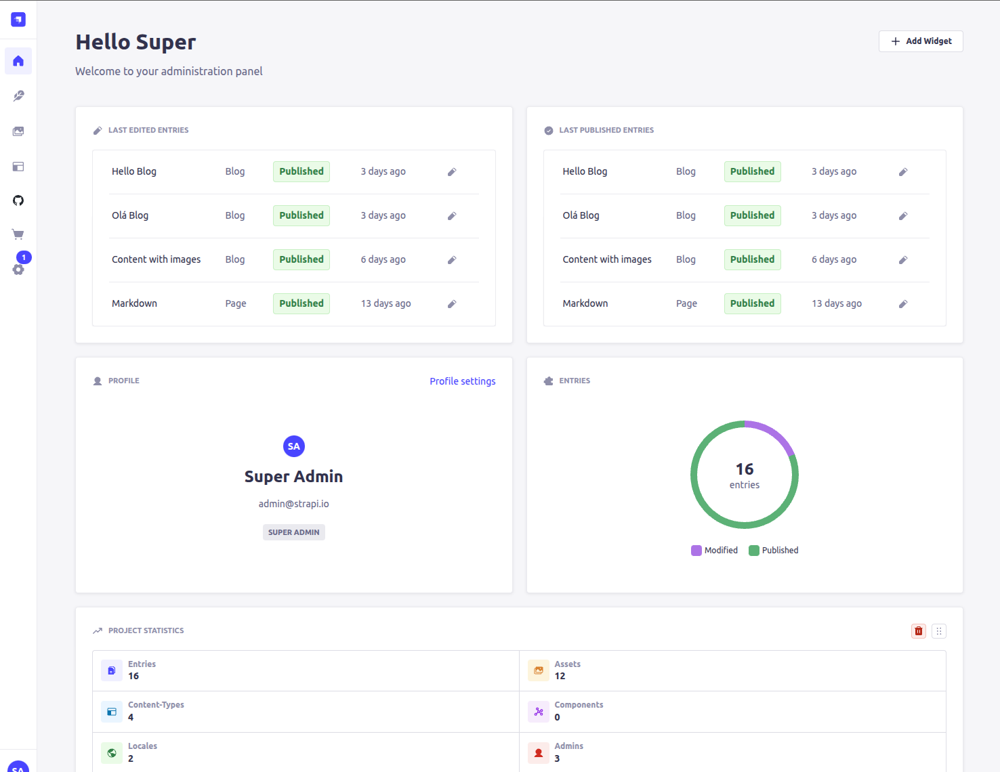

🔙 [README.md](../README.md)

# 🚏 Data Transfer between Strapi instances

## Steps - from local to the clould instance

### Setup the Transfer Token at the Strapi Cloud instance

1. Access the Strapi Cloud instance `https://<project>.strapiapp.com/`

2. Login as a `super admin user`

3. Click on the `Administration Panel > Transfer Tokens` menu item

4. Click on the `+ Create new Transfer Token` or `+ Add new Transfer Token`

5. Fill up the Transfer Token form

   

6. Click on the `Save` button

   

7. Copy and safely store the generated token

### Transfer the local data into the Strapi Cloud instance

1. Make sure to have your local instance up and running

2. On another terminal execute the following command

   ```shell
   npm run strapi transfer -- \
    --to https://<project>.strapiapp.com/admin \
    --to-token <transfer-roken>
   ```

3. Config the following

   ```shell
   ? The transfer will delete existing data from the remote Strapi! Are you sure you want to proceed? (y/N) y
   ```

   Terminal execution output sample:

   ```shell
   ? The transfer will delete existing data from the remote Strapi! Are you sure you want to proceed? Yes

   Starting transfer...
   ✔ entities: 163 transferred (size: 201.7 KB) (elapsed: 5196 ms) (38.8 KB/s)
   ✔ assets: 60 transferred (size: 22.7 MB) (elapsed: 31411 ms) (740.6 KB/s)
   ✔ links: 268 transferred (size: 49.4 KB) (elapsed: 3915 ms) (12.6 KB/s)
   ✔ configuration: 32 transferred (size: 114 KB) (elapsed: 1033 ms) (110.3 KB/s)
   ┌─────────────────────────────────────────┬───────┬───────────────┐
   │ Type                                    │ Count │ Size          │
   ├─────────────────────────────────────────┼───────┼───────────────┤
   │ entities                                │   163 │     201.7 KB  │
   ├─────────────────────────────────────────┼───────┼───────────────┤
   │ -- admin::session                       │    64 │ (    31.7 KB) │
   ├─────────────────────────────────────────┼───────┼───────────────┤
   │ -- api::blog.blog                       │    28 │ (    61.2 KB) │
   ├─────────────────────────────────────────┼───────┼───────────────┤
   │ -- api::page.page                       │    14 │ (    76.8 KB) │
   ├─────────────────────────────────────────┼───────┼───────────────┤
   │ -- api::tag.tag                         │    16 │ (     4.7 KB) │
   ├─────────────────────────────────────────┼───────┼───────────────┤
   │ -- plugin::i18n.locale                  │     2 │ (     507 B ) │
   ├─────────────────────────────────────────┼───────┼───────────────┤
   │ -- plugin::upload.file                  │    12 │ (    19.3 KB) │
   ├─────────────────────────────────────────┼───────┼───────────────┤
   │ -- plugin::upload.folder                │     7 │ (     1.9 KB) │
   ├─────────────────────────────────────────┼───────┼───────────────┤
   │ -- plugin::users-permissions.permission │    18 │ (       5 KB) │
   ├─────────────────────────────────────────┼───────┼───────────────┤
   │ -- plugin::users-permissions.role       │     2 │ (     656 B ) │
   ├─────────────────────────────────────────┼───────┼───────────────┤
   │ assets                                  │    60 │      22.7 MB  │
   ├─────────────────────────────────────────┼───────┼───────────────┤
   │ -- .jpg                                 │    10 │ (   868.9 KB) │
   ├─────────────────────────────────────────┼───────┼───────────────┤
   │ -- .png                                 │    50 │ (    21.9 MB) │
   ├─────────────────────────────────────────┼───────┼───────────────┤
   │ links                                   │   268 │      49.4 KB  │
   ├─────────────────────────────────────────┼───────┼───────────────┤
   │ configuration                           │    32 │       114 KB  │
   ├─────────────────────────────────────────┼───────┼───────────────┤
   │ Total                                   │   523 │      23.1 MB  │
   └─────────────────────────────────────────┴───────┴───────────────┘
   Transfer process has been completed successfully!
   ```

4. Access the cloud instance with the `super admin user` to check the changes

   

## Useful References

- [strapi transfer | Strapi CLI - Strapi Docs](https://docs.strapi.io/cms/cli#strapi-transfer)

- [Data Transfer | Strapi Docs](https://docs.strapi.io/cms/data-management/transfer)
